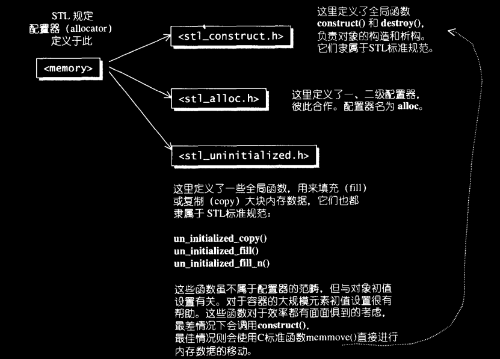
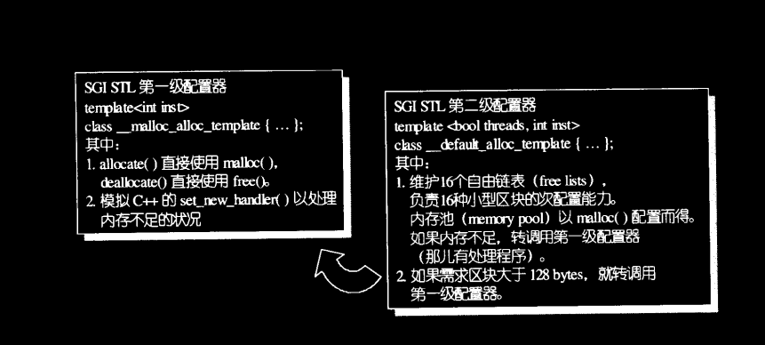
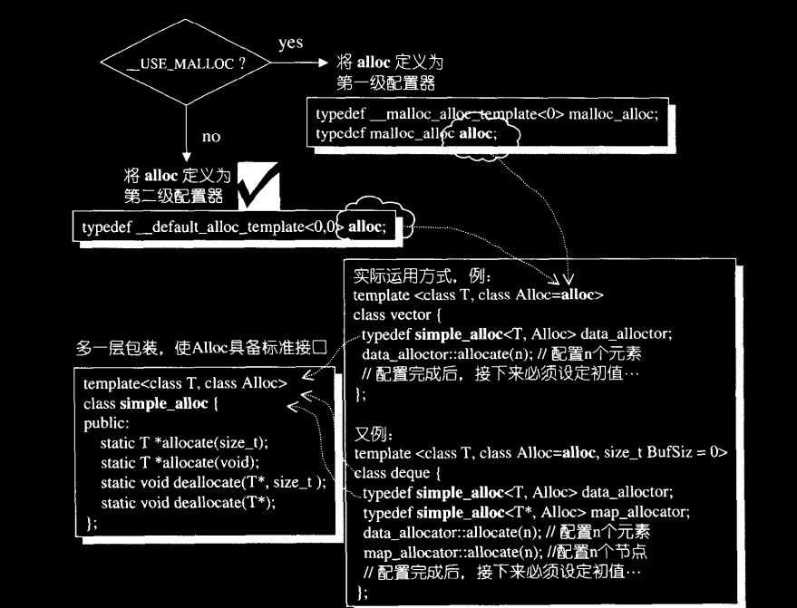
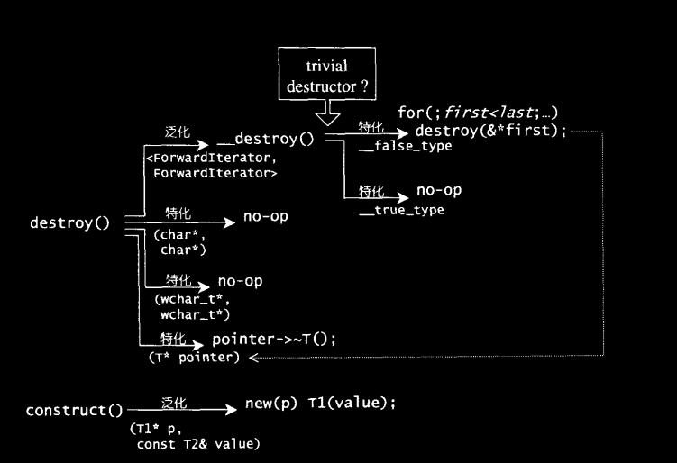

# 2. 空间配置器(allocator)
> *它总是隐藏在一切组件（更具体指容器，container）的背后，默默工作，默默付出。*
> 
> [2.1 空间配置器的标准接口](#21-空间配置器的标准接口)
> 
> [2.2 具备次配置能力(sub-alloction)的SGI空间配置器](#22-具备次配置能力的SGI空间配置器)

## 2.1 空间配置器的标准接口
> *根据STL的规范，allocator必须由些必要接口*

* **allocator::value_type**
* **allocator::pointer**
* **allocator::const_pointer**
* **allocator::reference**
* **allocator::const_reference**
* **allocator::size_type**
* **allocator::difference_type**
* **allocator::rebind**：一个嵌套的类模板。class rebind<U>拥有唯一成员other，是一个typedef，代表allocator<U>
* **allocator::allocator()**：默认构造函数default constructor
* **allocator::allocator(const allocator&)**：拷贝构造函数copy constructor
* **template<class U> allocator::allocator(const allocator<U>&)**：泛化的copy constructor
* **allocator::~allocator()**：析构函数，destructor
* **pointer allocator::address(reference x) const**：返回某个对象的地址，等同于&x
* **const_pointer allocator::address(const_reference x) const**：返回某个const对象的地址，等同于&x
* **pointer allocator::allocate(size_type n,cosnt void* = 0)**：配置足以存储n个T对象。第二个参数貌似没啥用
* **void allocator::deallocate(pointer p,size_type n)**：归还先前配置的空间
* **size_type allocator::max_size() const**：返回可成功配置的最大量
* **void allocator::construct(pointer p,const T& x)**：等同于new ((const void*)p) T(x)，意思是在p所指位置构造T对象
* **void allocator::destroy(pointer p)**：等同于p->~T()

> *根据前述标准，我们可以自行完成一个功能简单，接口不怎么齐全的[JJ::allocator](code/ch2/jjalloc.h)*

    //注：该配置其功能非常简单有限，很难与STL的容器进行搭配，因为无论哪种STL的allocator设计地都很复杂，还用到了缓冲区的概念。但这个示例很好地展示了配置器的思想。
    //file: jjalloc_2.h
    #ifndef _JJALLOC_2_H_
    #define _JJALLOC_2_H_

    #include <new>          //for placement new
    #include <cstddef>      //for ptrdiff_t,size_t
    #include <cstdlib>      //for exit()
    #include <climits>      //for UINT_MAX
    #include <iostream>     //for cerr

    namespace JJ {

        template <class T>
        inline T* _allocate(ptrdiff_t size,T*) {
            //T* 参数的传递只是为了让模板可以根据调用情况自动生成代码，而不用指定模板参数
            std::set_new_handler(0);    //指定new操作失败时的处理函数，传0参即表示不处理
            T* tmp = (T*)(::operator new((size_t)(sizeof(T)*size)));  //operator new 只分配内存，不执行构造函数
            if(tmp == 0) {
                std::cerr<<"out of memory"<<endl;
                exit(1);
            }
            return tmp;
        }

        template <class T>
        inline void _deallocate(T* buffer) {
            ::operator delete(buffer);      //operator delete 仅仅回收内存，不执行析构函数
        }

        template <class T1,class T2>
        inline void _construct(T1* p,const T2& value) {
            new (p) T1(value);      //在p所指内存上执行构造函数T1(const T2&)
        }

        template <class T>
        inline void _destroy(T* ptr) {
            ptr->~T();          //执行ptr所指对象的析构函数
        }

        template <class T>
        class allocator {
        public:
            typedef T value_type;
            typedef T* pointer;
            typedef const T* const_pointer;
            typedef T& reference;
            typedef const T& const_reference;
            typedef size_t size_type;
            typedef ptrdiff_t difference_type;

            template <class U>
            struct rebind
            {
                typedef allocator<U> other;
            };
            
            pointer allocate(size_type n,const void *hint = 0) {
                return _allocate((difference_type)n,(pointer)0);
            }

            void deallocate(pointer p,size_type n) {
                _deallocate(p);
            }

            void construct(pointer p, const T& value) {
                _construct(p,value);
            }

            void destroy(pointer p) {
                _destroy(p);
            }

            pointer address(reference x) {
                return (pointer)&x;
            }

            const_pointer address(const_reference x) {
                return (const_pointer)&x;
            }

            size_type max_size() const {
                return size_type(UINT_MAX/sizeof(T));
            }
        };
    }   //end namespace JJ
    #endif

## 2.2 具备次配置能力的SGI空间配置器
> *SGI STL的配置器与众不同，也与标准规范不同，其名称是alloc而非allocator，而且不接受任何参数。虽然SGI也定义有一个符合标准，名为[allocator](code/ch2/sgi_allocator.h)的配置器，但SGI了从未使用过它，也不建议我们使用，主要原因是效率不佳。*

> *allocator只是配置基层内存的配置/释放行为，并未考虑任何效率上的强化*

* 一般而言，我们所习惯的C++内存配置操作和释放操作是这样的：

        class Foo { ... };
        Foo* pf = new Foo;  //配置内存，然后构造对象
        delete pf;          //将对象析构，然后释放内存
   * 其中的new操作分为两阶段：（1）调用::operator new配置内存； （2）调用Foo::Foo()构造对象内容
   * delete操作也分为两阶段：（1）调用Foo::~Foo()将对象析构； （2）调用::operator delete释放内存

* 为了精密分工，STL allocator决定将这两阶段操作区分开来。STL标准规格告诉我们，配置器定义于<memory>之中，SGI<memory>内包含下列文件：
    
    1. #include <stl_alloc.h> //负责内存空间的配置与释放
    
    
    1. #include <stl_construct.h>   //负责对象内容的构造与析构
    

### 2.2.5 第一级配置器__malloc_alloc_template剖析
代码如下：

    #if 0       //#if 0 也可以进行代码注释
    #   include <new>
    #   define __THROW_BAD_ALLOC throw bad_alloc    
    #elif !defined(__THROW_BAD_ALLOC)   //如果__THROW_BAD_ALLOC宏没有定义，则如下语句被添加
    #   include <iostream.h>
    #   define __THROW_BAD_ALLOC cerr << "out of memory" <<end; exit(1)
    #endif

    //malloc-based allocator通常比default alloc速度慢
    //一般而言是thread-safe,并且对于空间的运用比较高效
    template <int inst>
    class __malloc_alloc_template {
    private:
        //oom: out of memory
        static void *oom_malloc(size_t);    //malloc失败时调用
        static void *oom_realloc(void*, size_t);    //realloc失败时调用
        static void (* __malloc_alloc_oom_handler) ();  //函数指针，malloc失败的处理函数，可以赋值

    public:
        static void * allocate(size_t n) {
            void* result = malloc(n);
            if(0 == result) result = oom_malloc(n);
            return result;
        }

        static void * deallocate(void* p, size_t) {
            free(p);
        }

        static void * reallocate(void *p, size_t, size_t new_sz) {
            void *result = realloc(p, new_sz);
            if(0 == result) result = oom_realloc(p, new_sz);
            return result;
        }

        //以下是实现C++的set_new_handler()
        //可以通过该函数指定自己的out-of-memory handler
        static void (*set_malloc_handler(void (*f)()))() {
            void (*old)() = __malloc_alloc_oom_handler;
            __malloc_alloc_oom_handler = f;
            return old;
        }
    };

    //malloc_alloc out-of-memory handler
    //初值为0，需要客户端设定
    template <int inst>
    void (* __malloc_alloc_template<inst>::__malloc_alloc_oom_handler)() = 0;

    template <int inst>
    void * __malloc_alloc_template<inst>::oom_malloc(size_t n) {
        void (* my_malloc_handler)();
        void *result;
        for(;;) {       //不断尝试释放，配置内存，直到配置成功
            my_malloc_handler = __malloc_alloc_oom_handler;
            if(0 == my_malloc_handler) {__THROW_BAD_ALLOC;}
            (*my_malloc_handler)();     //调用处理例程，企图释放不需要的内存
            result = malloc(n);
            if(result) return result;
        }
    }

    template <int inst>
    void * __malloc_alloc_template::oom_realloc(void *p,size_t n) {
        void (* my_malloc_handler)();
        void *result;
        for(;;) {
            my_malloc_handler = __malloc_alloc_oom_handler;
            if(0 == my_malloc_handler) {__THROW_BAD_ALLOC;}
            (*my_malloc_handler) ();
            result = realloc(p,n);
            if(result) return result;
        }
    }

### 2.2.6 第二级配置器__default_alloc_template剖析
SGI第二级配置器的做法是，如果请求区块够大，超过128 bytes时就移交第一级配置器处理。当区块小于128 bytes时，则由内存池管理。代码如下：

    enum {__ALIGN = 8}; //小型区块的上调边界
    enum {__MAX_BYTES = 128};   //小型区块的上限
    enum {__NFREELISTS = __MAX_BYTES/__ALIGN};  //free-lists个数

    //以下是第二级配置器，第一参数用于多线程环境下，第二参数没有用
    template <bool thread, int inst>
    class __default_alloc_template {
    private:
        //将size上调至__ALIGN的倍数
        static size_t ROUND_UP(size_t bytes) {
            return ((~(__ALIGN-1) & (bytes+__ALIGN-1)));
        }

        union obj {     //free-lists的节点构造
            union obj * free_list_link;
            char client_data[1];
        }

        //16个不同大小的free-lists;
        static obj * volatile free-list[__NFREELISTS];
        //根据请求区块大小，决定使用哪一条free-lists
        static size_t FREELIST_INDEX(size_t bytes) {
            return ((bytes+__ALIGN-1)/__ALIGN);
        }
    }
    //剩下还有好多，不抄了

    