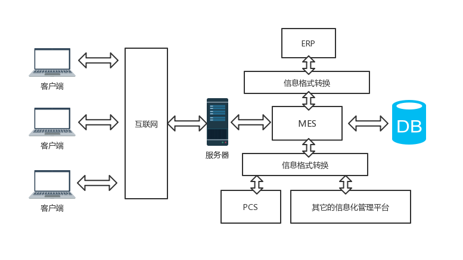

# ***4.17***
# 1. 主要工作
通过查阅文献和相关资料，了解离散制造业的特点，制造执行系统的概念和基本结构，并就离散制造业对生产计划管理系统的需求作出分析
# 2. 工作成果
## 2.1 离散制造业的特点
1. 产品的生产过程通常被分解成许多独立的加工任务
2. 每项加工任务仅占用车间的部分能力和资源
3. 产品不同类型的工序一般在不同的工作中心进行
4. 产品加工的工艺路线和设备的使用灵活
5. 产研混合，对生产调度的要求较高
## 2.2 制造执行系统的概念
MES是一个面向车间层的生产管控平台，其出现不是为了取代现有的企业资源管理系统或者车间自动化平台，而是为了弥补生产计划与生产现场之间信息传递效率低的不足，以提高企业生产效率。其作用主要体现在对生产现场的资源、物流控制，业务协调和信息集成；统一控制物料、设备、人员流程指令和设施等工厂资源，以实现有序、协调、可控的制造执行效果。MESA在MES的定义中强调了以下三点：
- MES应对整个车间的生产制造过程进行优化，而不是单一的解决某个生产瓶颈
- MES需要能够对生产信息流中的数据进行收集，分析和处理
- MES要能够与计划层和设备控制层方便的进行集成，以完成企业信息的连续性流动。
## 2.3 制造执行系统的基本结构
综合考虑MES的多功能性、可扩展性、可集成性以及和其它信息系统交互的能力，一个典型的MES的结构如图所示：

这种MES架构的功能可分为三层：应用层，功能层和数据接口层。应用层主要提供统一的图形用户界面（浏览器页面或者其它独立的带有图形界面的软件）与用户交互，并通过内部的通信机制向服务器中的相关服务对象发送请求应用服务器中的服务对象封装了相关的管理功能，并且可以通过内部协议相互通信，以协调完成客户端请求。功能层是MES的核心，这里MES分为许多功能子模块，如生产调度管理模块，资源管理模块。这样的设计易于扩展和切割整个系统，也便于整个系统的维护。数据接口层主要是提供数据库访问功能和MES与其他现有系统数据访问之间的格式功能。这可以最小的成本集成现有系统，避免重复开发，节省开发成本。
## 2.4 离散制造业对生产计划管理系统的需求分析
1. 提供导入订单的接口，包括手工导入、文件导入和与其它系统的集成导入
2. 能够给出车间内的各种资源和人员信息给出直观的统计分析，如订单信息，设备信息，工艺流程，生产计划，物料等
3. 能够根据用户类型有选择的开放系统的功能
4. 能够完整的跟踪订单从获取到排产的整个过程中的状态
5. 提供加工工艺的可视化编辑功能
# 3. 参考文献
1. 制造执行系统原理与技术 王爱民
2. 面向离散制造业的制造执行系统研究 王琦峰
