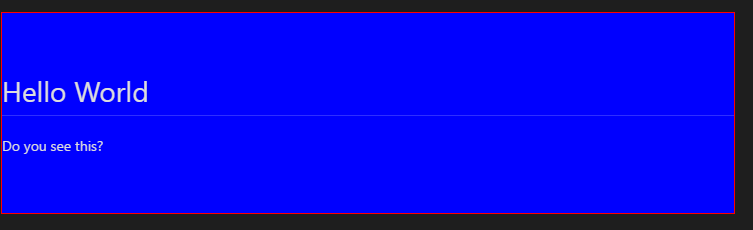

# CSS知识精粹

## 一、CSS盒模型(border,padding,margin)

### 1. 在html文档中，每个元素都被表示为一个矩形的盒子，每个盒子都由*外边距(margin),内边距(padding),边框(border),以及内容区域(content area)*组成，这些均可通过相应属性调整。**注意：block，inline-block元素可以通过调整高宽来控制盒子大小，inline元素则不能(可以通过line-height控制高度)！！！**

### 2. box-sizing属性决定了盒子怎样使用自己的高度和宽度

- border-box(比较常用):盒子的padding，border均算作盒子的高和宽里
- content-box:盒子的高宽只与内容区域有关

### 3. 相邻元素的外边距会发生合并，原则是保留外边距大的那一个(注意子元素和父元素也有可能发生边距合并，解决办法是给父元素增加内边距或边框)

## 二、CSS定位属性(position)

### 1. static定位

- 无特殊定位方式，对象遵循正常文档流。控制位置的属性(top,bottom,left,right)无效

### 2. relative定位

- 对象遵循正常文档流，保留其占位空间。其位置相对正常位置发生移动，top和left优先控制，下同。

### 3. absolute定位

- 对象脱离正常文档流，不保留占位空间。其位置相对祖先中的非static定位元素发生移动

### 4. fixed定位

- 对象脱离正常文档流，不占空间，位置浏览器窗口进行定位，且不随滚动条滚动。

### 5. z-index属性

- 除static定位外，元素重叠时，z-index值越大显示优先级越高

## 三、CSS显示属性(display)

## 四、CSS浮动属性(float)的应用

- float元素会脱离正常文档流，不会再参与基线位置的确定。但会占有其所在位置的空间。浮动的原则是往左或往右寻找上一个浮动元素的边，并停靠，不论是不是兄弟元素。

- block元素内的元素浮动时不参与确定父元素的高度，容易引起高度坍塌问题

- inline元素内的元素浮动时会参与父元素高度的确定。

- inline元素在浮动时margin和padding会生效

- 经常用于文字围绕

## 五、CSS奇淫巧技

### 1. *display:table*是一个可以使盒子模型具有类table显示功能的属性

- 与子元素属性*display:table-cell*配合使用，可以使子元素里的内容相对该子元素居中对齐，效果如下

        .parent{
            display:table;
            border:1px solid red;
            width:100%;
            height:200px;
        }
        .son{
            display:son;
            background-color:blue;
        }
        

            

                <h1>Hello World</h1>
                
Do you see this?

            

        

   

### 2. 因子元素设置浮动而引起的高度坍塌问题

- 利用clearfix类，在父元素的最末添加一个块元素清除前面的子元素设置float造成的影响。代码如下

        .clearfix:after{
            display:block;
            clear:both;
            content:"";
        }

### 3. [深入了解line-height和vertical-align](https://segmentfault.com/a/1190000004666195)

- 对于行内元素来说，内容区域的高度由font-size决定，且与其他属性无关。

- line-height不能决定内容区域的高度，但可以影响父元素的高度。父元素的height和line-height有区别，且不存在绝对的一个确定另一个的关系。line-height会被子元素继承。一般父元素未设置高度的情况下，其高度是由子元素共同决定的，且默认时由内容区域决定。

- 文本元素会首先确定所在位置，然后再根据后续内嵌元素的定位进行调整（基于基线对齐的方式进行调整）。

- 文本元素默认的垂直对齐方式为基线对齐baseline，且在只有文本元素的情况下，基线位置仅由font-size和line-height决定。若行内有其他inline类元素，如(span,em,a)等，则需要先将不是基线对齐的元素正确定位之后再确定本行的基线(基线位置确定之后可向外传递)。基线会选择本行内嵌元素的基线位置的最高者。内嵌元素基线的确定原则是：空元素基线由margin-bottom位置确定，非空元素按上述原则递归确定基线位置。

- vertical-align,分为基线对齐和非基线对齐方式
    1. 非基线对齐方式
        - top：该元素顶端(包括行高在内，下同)与父元素顶端对齐
        - bottom:该元素底端与父元素底端对齐
        - text-top:该元素的顶端与内容区域(直接文本域)的顶端对齐，前提是该元素没有取代内容区域成为父元素行高的决定者
        - text-bottom:该元素的底端与内容区域的底端对齐，前提同上。
    2. 基线对齐相关方式
        - length:正，负表示该元素基线偏离行基线的大小
        - percentage：同上，以百分数表示
